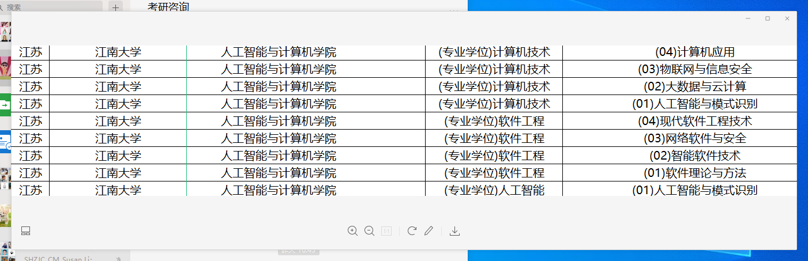

### 买房政策
```
 外地的必须先结婚才能买房.大家之所以挤破头皮往上海买房子,完全是要利用上海的优势: 1. 很好的社会资源,包括医院,学校,交通等. 2. 容易找工作. 3. 高考分数线低,容易考上大学. 4. 实在混不下去可以卖
 房子,因为这个地方每年都有大量的年轻人来找工作,房价可以是说是很稳的.哪天不想干了,一个转手卖掉,还能得到很多钱!
```

### 落户政策
```
  除了研究生以上这样的高学历以外，一般为居住证期间内工作满7年才可以申请落户！很多人来上海都不知道这个居住证的价值,
  浪费了一个机会，白白干了那么多年。来上海一定要刚开始的时候找本地房东搞到居住证，这个房东带身份证就去区委会一趟很快搞定。
  合租的情况，最多只能3个名额一户。
```
### 养老金政策 [养老金细则](https://www.zhihu.com/question/278266651)
```
  上海养老金:本地户口累计10年(120个月)可以领(一般来说36岁左右就可以用了),外地户口则需要15年(180个月)才可以使用,那个时候也已经40多岁了.
  个人感觉: 趁年轻多玩,多赚钱,多学本事,锻炼一个好的身体.老了就过低配的生活好了,不要对中国的养老金抱太多幻想!
```

### 证书评级政策
```
  可以去人事网 http://cpta.mohrss.gov.cn/index.html, 咨询,购买教材,报名考试,通过考试拿到相应岗位的证书;一般落户和
  公司人才引进策略都会用到.建议在工作一年后的时候就开始报名(一般是需要大学文凭和工作经验才可以考的)
  最好选对口的专业,这样会好考一些.
```

### 其他类证书如 [PMP 考试](https://www.zhihu.com/question/23069324)  语言类考试: 英语(CET4/6, SAT, IELTS,TOFEL,GRE,GMAT),德语(B1-C2),日语(N1-N2),西班牙语(B1-C2)

### 非全日制硕士招生(严进宽出)

```
  很可惜上海要求最低是本科才有资格报名入学考试.专科可以考虑其他地方的学校.非全日制的学校头一年是周末去上课,以后就是线下课
  考试都合格可以获得学历和学位证书.
  大致整个流程为: 
  1. 入学考试:4门(政治,英语,高数,408计算机综合,满分500) 12月考试,次年3,4月复试(含英语面试),一次不过等一年
  2. 考试通过,需要自己报名所要去读的学校(报名费百元,学费每年1万左右,一套下来估计得个3,4万)
  3. 学习是头一年每周末去学校学 计算机软件工程为例子 4门计算机相关的课程(c语言,计算机原理,操作系统,网络);作业计学分;
  4. 后面两年跟着导师做项目,中间会考成绩合格,最后论文答辩过了就可以毕业(获得研究生学历和硕士学位)
```
