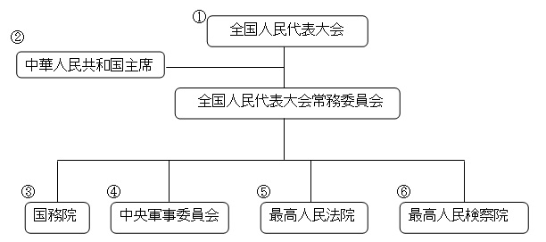

### 从来没有一个从政的人敢拍着胸脯对人说自己从政没有一点私心,一心一意为人民.当然他们一定也不会这么做!
### 政治具有一定的邪恶性,进入了政治的圈子很多事情都是难以自控,很难独善其身.因此自古以来普通人都敬而远之!
### 说归说,了解一下还是很有必要的.也许哪一天就派上了用场.
```
国体，即国家性质，是指社会各阶级在国家中的地位。具体地说，就是国家政权掌握在哪一个阶级手中；哪个阶级是统治阶级，
哪个阶级是被统治阶级。统治阶级的阶级性质决定着国家性质
```
```
政体，即国家政权的[组织形式]，即统治阶级采取何种形式来组织自己的政权机关
```
## 国体决定政体
## 中国的国体: 人民民主专政的社会主义国家
## 中国的政体: 人民代表大会制度


