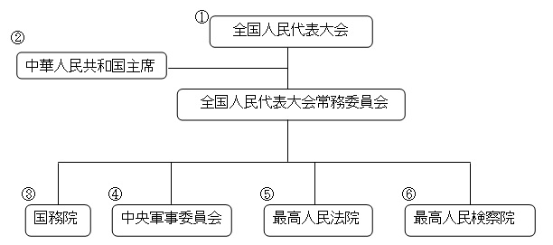

### 从来没有一个从政的人敢拍着胸脯对人说自己从政没有一点私心,一心一意为人民.当然他们一定也不会这么做!
### 政治具有一定的邪恶性,进入了政治的圈子很多事情都是难以自控,很难独善其身.因此自古以来普通人都敬而远之!
### 说归说,了解一下还是很有必要的.也许哪一天就派上了用场.
```
国体，即国家性质，是指社会各阶级在国家中的地位。具体地说，就是国家政权掌握在哪一个阶级手中；哪个阶级是统治阶级，
哪个阶级是被统治阶级。统治阶级的阶级性质决定着国家性质
```
```
政体，即国家政权的[组织形式]，即统治阶级采取何种形式来组织自己的政权机关
```
## 国体决定政体
## 中国的国体: 人民民主专政的社会主义国家
## 中国的政体: 人民代表大会制度



## 现代我国官阶分为部、厅 、局、处、科共五级

```
官衔级别的排列如下

1、国家级正职：中共中央总书记、国家主席、国务院总理、中央军事委员会主席、全国政协主席等。

2、国家级副职：国家副主席、国务院副总理、中央政法委书记、最高人民法院院长、最高人民检察院检察长等。

3、省部级正职：各省省长、书记、直辖市市长、书记、国家各部委部长、书记等。

4、省部级副职：省委常委、副省长、副部长等。

5、厅局（地）正职：各地级市市长、省厅厅长、书记等。

6、厅局（地）副职：各地级市副市长、或市委常委、省厅副厅长等。

7、县处级正职：各县县长、地级市各区区长、地级市行政或者事业局机关局长等。

8、县处级副职：各县副县长、副书记、副区长、地级市行政或事业局局长等。

9、乡科级正职：各镇镇长、各区县下设局机关的局长、街道办事处主任等。

10、乡科级副职：副镇长、区县副局长、街道办副主任等。

11、股所级正职（科员）：各地市、县市人大、政府、政协的下属单位所属科室的股所级干部正职等。

12、股所级副职（科员）：各地市、县市人大、政府、政协的下属单位所属科室的股所级干部副职等。

13、普通科员：各地市、县市人大、政府、政协的下属单位所属科室的普通科员等。

14、办事员：各地市、县市人大、政府、政协的下属单位所属科室的办事员等。
```

### 国家级会议
[全国代表大会及中全会总表](https://zh.wikipedia.org/wiki/%E4%B8%AD%E5%9B%BD%E5%85%B1%E4%BA%A7%E5%85%9A%E4%B8%AD%E5%A4%AE%E4%BC%9A%E8%AE%AE%E5%88%97%E8%A1%A8)
一般格式为: 中国共产党第 N 次全国代表大会  中共 N 届 N 中全会,中会通常是在全国代表大会之前开,最后汇总到全国代表大会.
会议都是关于国计民生的决策,法律修正案,任免,换届选举等的决策.
### 换届选举
本来宪法```(法理上拥有最高的法律效力，是中华人民共和国政府一切法律制度的基础)```是规定不准超过两届(5年为一届),2018年这个限制去除了.

